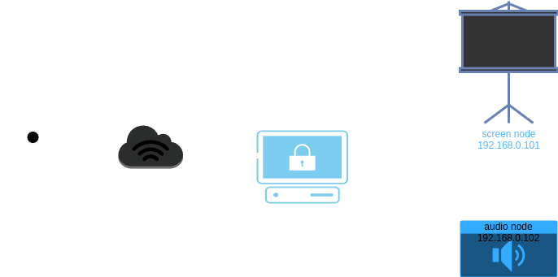

# DnD toolkit

**Note:** It's a very working title - just to name it for myself.

This project purpose is mainly to allow myself run my RPG sessions better by controlling various aspects from
centralized solution. And moreover - it's mainly developed as a challenge for learning more Rust and having a lot of
fun with it. For the moment, if you in any surprising way manage to get access to this very private project, do not
expect anything of it. Not even to run (sometimes).

Purpose of this project is not to create a new/next/another virtual tabletop solution. I play with friends in
old-school way with paper, pencils, mini figs, etc. But of course good use of modern technology can elevate gaming
experience. This software is not going to replace physical aspects of our RPG session, but enhance it by coordinating
various multimedial boosters, like controlling audio playback.

Main rule, while working on architectual and conteptual aspects is that this should be a thin integration layer, not
some uber-bundle capable of running on embedded systems controlling media devices and implementing audio codecs - I
use Spotify to play my audio and all I want to implement is to integrate Spotify into the system to orchestrate it
togetether with other aspects of our game scene. Same principle will apply to other subsystems - the goal is to
integrate existing software solutions/services not to write low-level replacements of these.

## Current features

- Audio playback control using various.
    - Spotify;
- multi-node setup possible using gRPC;
- configuration via JSON file.

### Void driver

Whenever possible, any subsystem will have a `Void` implementation that will simply reduce in no-op handling of
corresponding aspects. For example setting audio driver to `Void` will make audio subsystem available, but will
effectively make it muted regardless of hardware and other parts of the system. It will, whenever possible, handle
operations gracefully, without failing. Will just do nothing and pretend it's done - you can think of it like your
office coleague.

## Configuration

Configuration is loaded from `config.json` file in current directory (in future other formats and location specified by
command-line argument can be expected). Here is example structure of configuration file:

```json
{
    "party_name": "Wesoła Kompanija",
    "game_master": {
        "name": "Rafał Wrzeszcz"
    },
    "audio": {
        "type": "Spotify"
    }
}
```

## Audio

Currently only implemented handler for audio subsystem is `Spotify`. It uses D-Bus to send playback requests to local
**Spotify** client. You need to have it installed and runnin for the driver to make any effect - otherwise it will not
fail, but just send messages that will not be handled by any consumer, thus make no effect.

## gRPC setup

Each instance has built-in support for gRPC protocol that can forward calls to another node - each system can be
configured separately, so it is possible to run separate nodes, with different configs across the network for dedicated
purposes:

To configure any node to run gRPC listener add `"rpc"` configuration section:

```json
{
    "party_name": "Wesoła Kompanija",
    "game_master": {
        "name": "Rafał Wrzeszcz"
    },
    "audio": {
        "type": "Spotify"
    },
    "rpc": {
        "listen": "0.0.0.0:50051"
    }
}
```

To access any other node configure particular driver as `Rpc` pointint to that node, eg.:

```json
{
    "party_name": "Wesoła Kompanija",
    "game_master": {
        "name": "Rafał Wrzeszcz"
    },
    "audio": {
        "type": "Rpc",
        "url": "http://192.168.0.100:50051"
    }
}
```

With such setup node `192.168.0.100`, with Spotify application running, will handle all audio playback actions, and
another node, for example on laptop can run as a controller.

### Proxying

Note, that it's possible to specify both `"rpc"` listener section and still forward some (or all) subsystems to `"Rpc"`
driver type. There is simply no reason to forbid that in the code and it gives possibility to create something like a
router node, you can think of exposing such router as unified gRPC endpoint through public connection or exposing
single node to others who would like to use and and configure others transparently:



**Note::** `"screen"` configuration section is currently purely theoretical, no concept around that exists for the
moment.

Client config:

```json
{
    "audio": {
        "type": "Rpc",
        "url": "http://your.public.endpoint:50051"
    },
    "screen": {
        "type": "Rpc",
        "url": "http://your.public.endpoint:50051"
    }
}
```

Master config:

```json
{
    "audio": {
        "type": "Rpc",
        "url": "http://192.168.0.100:50051"
    },
    "screen": {
        "type": "Rpc",
        "url": "http://192.168.0.101:50051"
    },
    "rpc": {
        "listen": "0.0.0.0:50051"
    }
}
```

Screen node config:

```json
{
    "audio": {
        "type": "Void"
    },
    "screen": {
        "type": "Local"
    },
    "rpc": {
        "listen": "0.0.0.0:50051"
    }
}
```

Audio node config:

```json
{
    "audio": {
        "type": "Spotify"
    },
    "screen": {
        "type": "Void"
    },
    "rpc": {
        "listen": "0.0.0.0:50051"
    }
}
```
